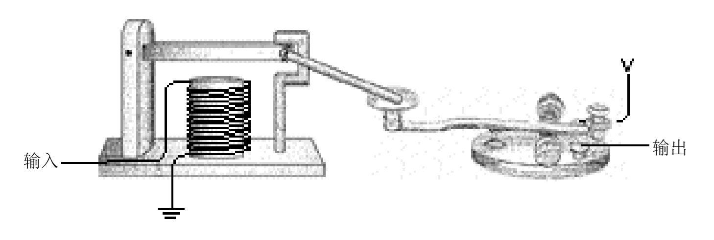

# 第6章 发报机与断电器

1 7 9 1年，萨缪尔·摩尔斯生于马萨诸塞州的查尔斯顿镇，该镇是邦克山之战的地点，也是波士顿东北重镇。摩尔斯出生那年，美国宪法刚实施两年，乔治·华盛顿出任美国第一个任期的总统职务。 C a t h e r i n e大帝统治俄国。路易十六世和 Marie Antoinette在两年后的法国大革命中被送上断头台。 1 7 9 1年，莫扎特完成了《魔笛》，他的最后一部作曲，次年于 3 5岁时去世。

 (1).png>)

摩尔斯在耶鲁受过教育，又在伦敦学过艺术，他是位著名 的肖像画家。他的作品《 General Lafayette》( 1 8 2 5 )珍藏于纽约 市政大厅。1 8 3 6年，他曾参与过竞选纽约市市长且获得了 5 . 7 % 的选票。他也是早先的摄影术狂热爱好者。他从 Louis Daguerre 本人那儿学习了银版相片的制作，制造出了美国第一批用银版 照相术制成的相片， 1 8 4 0年，他把这个手艺传授给了 1 7岁的 Mathew Brady。此人以及他的同事后来为美国内战、亚伯拉罕·林肯和摩尔斯本人留下了一些很有纪念价值的照片。&#x20;

这些只是一个多职业生涯者的足迹。摩尔斯最著名的贡献在于他发明了电报和以他名字命名的编码。&#x20;

世界范围内的即时通信我们已经很熟悉，但它是当今新技术发展的结果。 1 9世纪早期，你可以即时通信和远距离通信，但不能同时达到两个要求。即时通信只能限制在你的声音能达到（没有扩音器可用）或是你的眼睛能看到（也许得用望远 镜）的范围；远距离通信则要花时间用信件通过马车、火车或者轮船的方式来实现。

在早于摩尔斯发明的年代里，人们曾做过许多加速远距离通信的尝试。一种技术上简单的方法是雇佣一批人接力，站在山顶上用旗语信号通信。技术上稍微复杂一点儿的方法是使用巨大的带有可动手臂的装备，原理与旗语相同。&#x20;

电报思想的正式成形是在 1 9世纪早期。1 8 3 2年在摩尔斯开始试验之前，已经有其他科学家在做一些试探。原理上讲，电报思想很简单：你在线的一端做某些事引起线的另一端发生了某些事。这正是上一章用远距离手电筒所做的事情。但摩尔斯不可能使用灯泡作为他的信号设备，因为实用性灯泡直到 1 8 7 9年才发明出来。摩尔斯使用的是电磁现象。&#x20;

如果你取一只铁棒，用细导线将它绕几百圈，然后让电流通过导线，铁棒变成了磁铁，这时它就能吸引其他的铁和钢。（电磁铁上细线的电阻足够大以防止电磁铁形成短路。）移开电流，铁棒的磁性消失：

 (1).png>)

电磁铁是电报的基础。一端上开关的闭合引起另一端上的电磁铁产生一些动作。摩尔斯最早的电报机比后来改进的要复杂得多。

摩尔斯认为电报系统应该在纸上实际写点儿什么(这就像后来的电脑使用者描述的“生成一个硬拷贝” )。这当然不必是文字，因为文字太复杂，但某些字符应该记录下来，或曲线或点或划。注意，摩尔斯坚持要用纸记录下发报内容的这种想法，与Valentin Haüy要求盲人书籍应该使用突起的字母文字一样。&#x20;

尽管摩尔斯早在 1 8 3 6年就告知专利局他已经成功地发明了电报，但直到 1 8 4 3年，他才说服议会为此设备的示范表演出资赞助。 1 8 4 4年5月2 4日是有历史意义的一天， Wa s h i n g t o n和马里兰州巴尔的摩之间的电报线成功地传送了圣经上的一句话“ What hath God wrought！”。&#x20;

传统电报机发送消息的核心部分如下图所示：

 (1).png>)

尽管外观比较怪，但它只是一个为高速开合（闭）设计的开关，称为“按键 /按钮”。长时间按键最舒适的方式是在手掌的拇指、食指和中指之间握住把手，然后敲击。短时间敲击形成摩尔斯电码的点，长时间敲击形成摩尔斯电码的划。&#x20;

线的另一端是一个接收机，其基本结构是一个电磁铁吸拉一根金属拉杆。起初电磁铁控制的是一支笔，当由小装置控制的机械通过弯曲的弹簧缓慢地拖拉一卷纸时，相连的笔上下蹦弹将点划记录在纸上，懂得摩尔斯电码的人再将点划翻译成字母和文字。&#x20;

当然，人是会偷懒的。电报机使用者很快发现只要简单地利用笔跳上跳下的声音他们就能翻译编码。笔的装置最终被撤消，代替的是传统电报机的发声装置，称为“发声器 /音响器”， 结构如下：

 (1).png>)

当电报机的键按下时，发生器的电磁铁将可动棒拖下发出“滴”的声音；当键放开时，棒弹回初始位置，发出“嗒”的声音。快速的“嘀嗒”为点，慢速的则为划。&#x20;

按键、发声装置，电池和一些导线可像上一章所述手电筒电报一样连接起来：

 (1).png>)

我们已经知道，两个电报站之间不需要两根线。如果大地作为另一半回路的话，一根线就足够了。&#x20;

如上一章所做，我们用字母 V代替接地的电池，因此最终的单向设置如下图所示：

 (1).png>)

双向通信只不过再需要一个按键和发生器。与上章所做相似。&#x20;

电报的发明真正标志着现代通信的开始。人类首次能够在眼、耳的范围之外以快于马奔跑的速度通信。发明中使用的二元码是其精华所在，但在后来的电子和无线电通信中，包括电话、收音机和电视，二元码都没有用到，只到最近二元码才出现在计算机、 C D盘、D V D盘、数字卫星电视广播和高清晰电视中。

摩尔斯的电报机战胜了其他设计 ,部分原因是它对不好的电线状态的容忍度比较大。假如你在按键和发声装置之间接一根线，该电报机通常可以工作，但其他电报系统却不具备这样的容忍性。但正如上章所谈及的，最大的问题在于长距离导线的电阻。尽管一些电报线使用高达3 0 0伏的电压能在3 0 0英里的范围内工作，导线还是不能无限延伸。&#x20;

一个明显的解决办法是使用转发（中继）系统，也称继电器系统。大约每 2 0 0英里就让某位发报者通过发声装置接收消息再用按键发送出去。&#x20;

现在想像一下你已被某电报公司雇佣为转发系统的工作人员。他们把你放在纽约和加利福尼亚之间某个地方的一间简陋得只有一张桌子和一把椅子的小屋里。一根导线从东边的窗户进来连到发声装置上。你的按键连在电池和从西边窗子出去的导线上。你的工作是接收来自于纽约的消息然后把它们发送到加利福尼亚。&#x20;

起初，你是接收了整条消息后再转发它。你记录下发声器的嘀嗒，到消息接收结束，你再用你的按键将它们发送出去。最终你掌握了边听边发的技巧而不用把整条信息记录下来， 这节约了转发时间。

某天你在转发消息时，你注意到铁棒上下跳动又注意到了手指按动键的上下跳动。你看了看发声器又看了看键，然后你意识到棒的上下跳动与按键的上下跳动是一致的，于是你出去取回一根小木条，用这根木条和一些线把发声器和按键连接了起来：

现在它可以自动工作了，你可以去喝下午茶也可以去钓鱼了。

这只是一个趣味情景的想像。但实际上，摩尔斯很早就理解这个装置的思想。我们已经发明的这个装置叫重发器或继电器。一个继电器就像一个发声装置，输入的电流形成电磁用以拖动金属杆，金属杆作为开关的一个部分连接到外接的导线上。这样，微弱的输入电流被 扩大形成比较强的输出电流。&#x20;

继电器的概要描述如下图所示：

 (1).png>)

输入电流激发电磁铁，电磁铁吸引一根有弹性的金属条作为开关从而输出电流：

 (1).png>)

因此电报按键、继电器和发声器大致连接如下：

 (1) (1).png>)

继电器是一种卓越的设备。它是一个开关，但并不是由人工而是借助于电流进行开关操 作的。利用这种设备可以做出令人惊奇的事情。事实上，你可以用继电器装配出一台计算机中的大部分部件。&#x20;

是的，继电器这种设备是一种很好的发明，足以与电报相提并论。后面还将会用到，且它会变得非常小巧、方便。但是，在能够使用它之前，得先学会数数。

